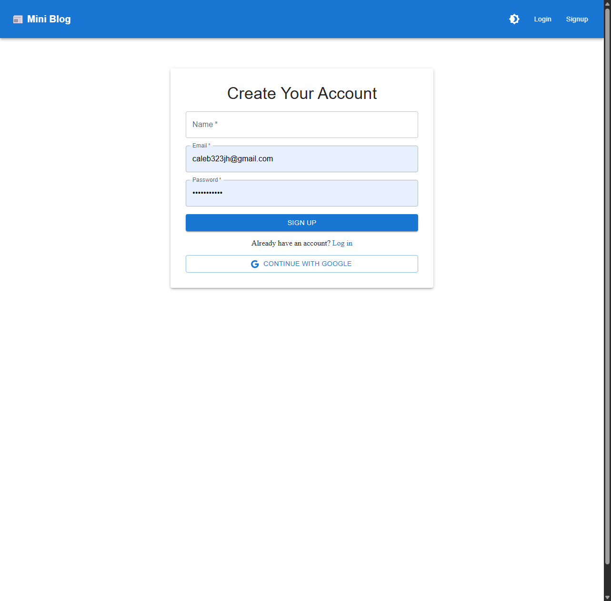
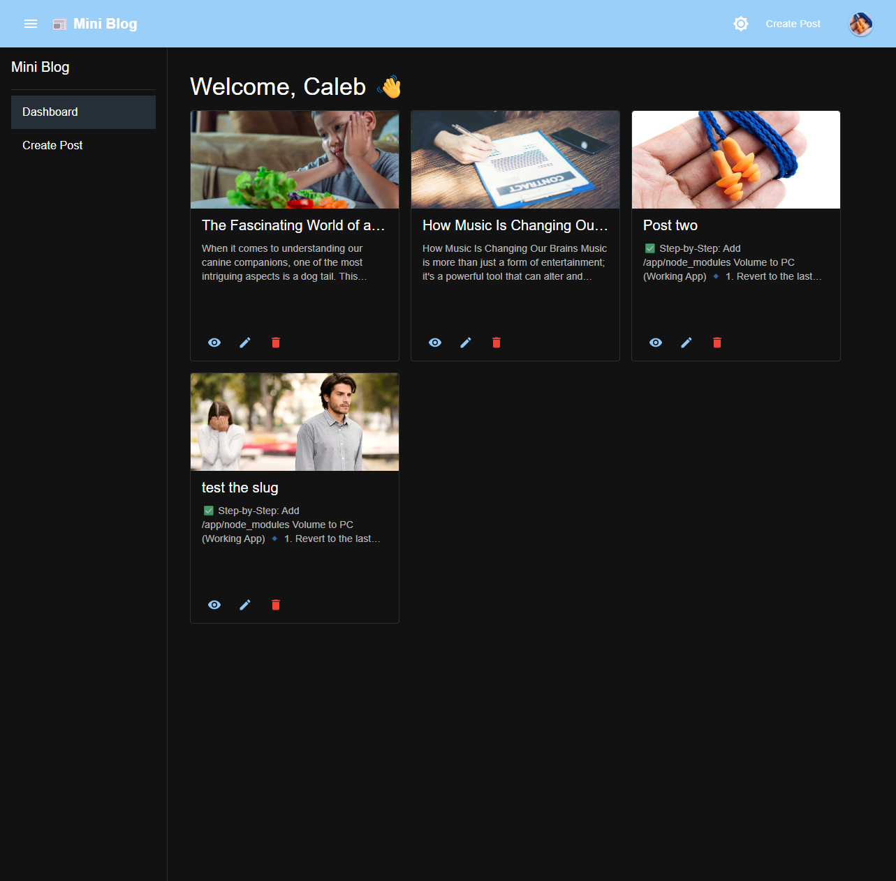
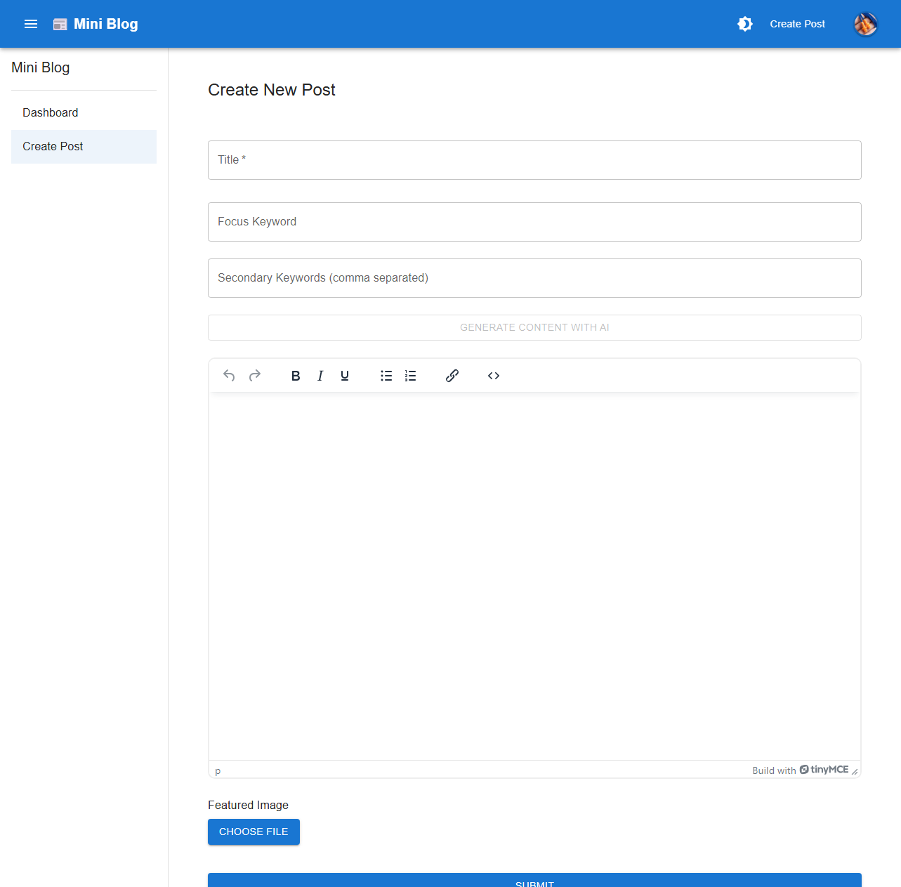

# 📰 Mini Blog CMS

**Full-Stack Content Management Platform**

A full-stack content management application built with **React, Node.js, Express, PostgreSQL, and Prisma**.

Mini Blog CMS demonstrates a production-style client/server architecture with secure authentication, user profiles, media uploads, rich-text content creation, persistent user preferences, protected application routes, and a fully Dockerized local development environment.

The project was built to demonstrate practical full-stack application development beyond basic CRUD functionality, including authentication flows, relational database design, media handling, API development, frontend state management, and containerized infrastructure.

---

## ✨ Features

### 🔐 Authentication & Security

* JWT-based authentication using access and refresh tokens
* Protected backend API routes
* Authentication-aware frontend routing
* Refresh-token handling with cookies
* User registration and login
* Email verification workflow
* Persistent authenticated sessions

### 📝 Content Management

* Create and manage blog posts
* Rich-text editing with **TinyMCE**
* Featured image uploads
* Public blog views
* Author information and profile display
* Database-backed content using PostgreSQL

### 👤 User Profiles

* User profile management
* Custom biography
* Avatar uploads
* Persistent user preferences
* User-specific theme settings

### 🎨 Frontend Experience

* Responsive React interface
* Material UI component system
* Dark and light themes
* Theme preference persistence
* Public and authenticated application views
* Vite-powered development environment

### 🖼️ Media Management

* Image uploads through the backend API
* User avatar support
* Featured images for blog posts
* Media validation and storage
* Uploaded media associated with application data

### 🐳 Infrastructure

* Fully Dockerized development environment
* Separate frontend and backend containers
* PostgreSQL database container
* pgAdmin database management
* Prisma ORM and database migrations
* Environment-based configuration
* Architecture designed for local development and production deployment

---

## 🧱 Tech Stack

| Layer          | Technology                         |
| -------------- | ---------------------------------- |
| Frontend       | React, Vite, Material UI           |
| Backend        | Node.js, Express                   |
| Database       | PostgreSQL                         |
| ORM            | Prisma                             |
| Authentication | JWT access + refresh tokens        |
| Rich Text      | TinyMCE                            |
| Media          | Express-based file uploads         |
| Containers     | Docker, Docker Compose             |
| Database Tools | pgAdmin                            |
| Deployment     | Docker-compatible cloud deployment |

---

## 🏗️ Architecture

Mini Blog uses a separated client/API architecture:

```text
┌─────────────────────────┐
│      React + Vite       │
│         Client          │
└────────────┬────────────┘
             │
             │ HTTP / REST
             ▼
┌─────────────────────────┐
│     Node + Express      │
│          API            │
└────────────┬────────────┘
             │
             │ Prisma ORM
             ▼
┌─────────────────────────┐
│       PostgreSQL        │
│        Database         │
└─────────────────────────┘
```

Docker Compose orchestrates the application services during local development.

---

## 🔑 Authentication Architecture

The authentication system separates short-lived application authentication from session renewal.

```text
Browser
   │
   ├── Access Token
   │      └── Used for authenticated API requests
   │
   └── Refresh Token
          └── Used to renew authentication
```

Protected backend routes validate authentication before allowing access to user-specific resources.

The frontend responds to authentication state by controlling access to protected application pages while maintaining separate public views.

---

## 📁 Project Structure

```text
full-stack-blog/
│
├── client/
│   ├── src/
│   ├── public/
│   ├── .env.example
│   ├── Dockerfile
│   └── package.json
│
├── server/
│   ├── controllers/
│   ├── middleware/
│   ├── routes/
│   ├── prisma/
│   │   ├── migrations/
│   │   └── schema.prisma
│   ├── .env.example
│   ├── Dockerfile
│   └── package.json
│
├── docker-compose.yml
├── .gitignore
└── README.md
```

---

## 📸 Screenshots

### Sign In


### Public Blog


### Private Dashboard


### Create / Edit Post


---

## 🚀 Running Locally

### Prerequisites

You will need:

* Git
* Docker
* Docker Compose

Because the application is containerized, Node.js and PostgreSQL do not need to be installed directly on the host machine when using the Docker development environment.

### 1. Clone the repository

```bash
git clone https://github.com/calebjhoffman/full-stack-blog.git
cd full-stack-blog
```

### 2. Configure environment variables

Example environment files are included in the repository.

Create your local environment files from the examples.

For the server:

```bash
cp server/.env.example server/.env
```

For the client:

```bash
cp client/.env.example client/.env
```

Update the values as necessary for your local environment.

### 3. Start the application

From the project root:

```bash
docker compose up --build
```

Docker Compose will start the frontend, backend, PostgreSQL database, and supporting development services.

Typical local services include:

```text
Frontend:   http://localhost:5173
Backend:    http://localhost:3000
API:        http://localhost:3000/api
pgAdmin:    http://localhost:5050
```

Ports may vary depending on the current Docker Compose configuration.

---

## ⚙️ Environment Configuration

Sensitive environment files are intentionally excluded from version control.

The repository contains `.env.example` files showing the variables required to run the application without exposing real credentials.

Example server configuration:

```env
DATABASE_URL=postgresql://postgres:postgres@db:5432/mini_blog

JWT_ACCESS_SECRET=your_dev_access_secret
JWT_REFRESH_SECRET=your_dev_refresh_secret

ACCESS_TOKEN_EXPIRES_IN=12h
REFRESH_TOKEN_EXPIRES_IN=7d

CLIENT_ORIGIN=http://localhost:5173
```

Example client configuration:

```env
VITE_API_BASE_URL=http://localhost:3000/api
VITE_SERVER_PUBLIC_URL=http://localhost:3000
```

Production secrets should be provided through the deployment platform's environment-variable or secrets-management system rather than committed to source control.

---

## 🗄️ Database

The application uses **PostgreSQL** with **Prisma ORM**.

Prisma manages the application schema, relationships, and database migrations.

Database changes are tracked through migration files so the database structure can be reproduced consistently across environments.

Common Prisma commands can be executed from within the server environment when necessary.

For example:

```bash
npx prisma migrate dev
```

and:

```bash
npx prisma studio
```

---

## 🐳 Docker Development

The application is designed around a containerized development workflow.

Docker Compose manages the application's primary services:

```text
Client
   │
   ├── React
   └── Vite

Server
   │
   ├── Node.js
   ├── Express
   └── Prisma

Database
   │
   └── PostgreSQL

Database Management
   │
   └── pgAdmin
```

This keeps the development environment reproducible and reduces differences between development machines.

---

## ☁️ Deployment

The frontend and backend are structured so they can be deployed independently while communicating through environment-configured API URLs.

The Docker-based architecture can be adapted to platforms that support containerized Node.js applications and managed or self-hosted PostgreSQL databases.

Production configuration should provide:

* PostgreSQL connection credentials
* JWT secrets
* Allowed frontend origin
* Production API URL
* Media/storage configuration
* Any third-party service credentials

No production secrets are stored in this repository.

---

## 🎯 What This Project Demonstrates

This project was built as a practical implementation of modern full-stack JavaScript development.

It demonstrates experience with:

* Designing REST APIs
* Building React applications
* Structuring Node.js/Express backends
* Relational database design
* PostgreSQL
* Prisma ORM
* Authentication and authorization
* Access and refresh-token workflows
* Protected frontend and backend routes
* User account management
* Media uploads
* Rich-text content management
* Persistent user preferences
* Responsive UI development
* Docker and Docker Compose
* Environment configuration
* Database migrations
* Client/server architecture
* Production-oriented application structure

---

## 👨‍💻 Developer

Built by **Caleb Hoffman**, a full-stack JavaScript developer focused on building practical web applications, business tools, and modern SaaS-style systems.

**Core technologies:** React • Node.js • Express • PostgreSQL • Prisma • Docker

[GitHub — calebjhoffman](https://github.com/calebjhoffman)

---

## 🪪 License

MIT License
